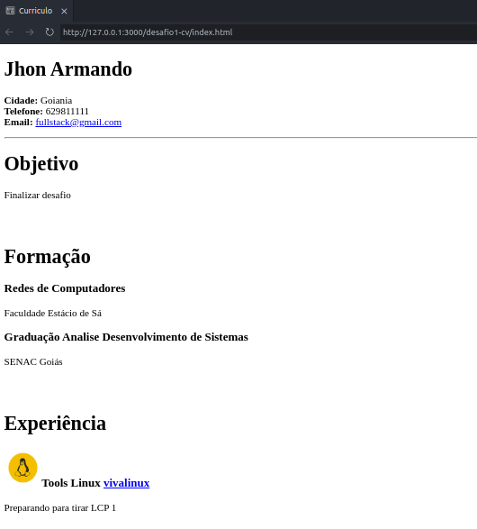

Desenvolvimento WEB

HTML Básico
HTML Intermediário

Css Básico
Css Intermediário 

Projetos
- 1 Desafios 
  - Criando um CV
  
  - Pagina de captura 
  

1. Desafios Equipe
  > Aplicar aprendizado replicando projetos existentes
  `Primeiro Projeto` 
  - 